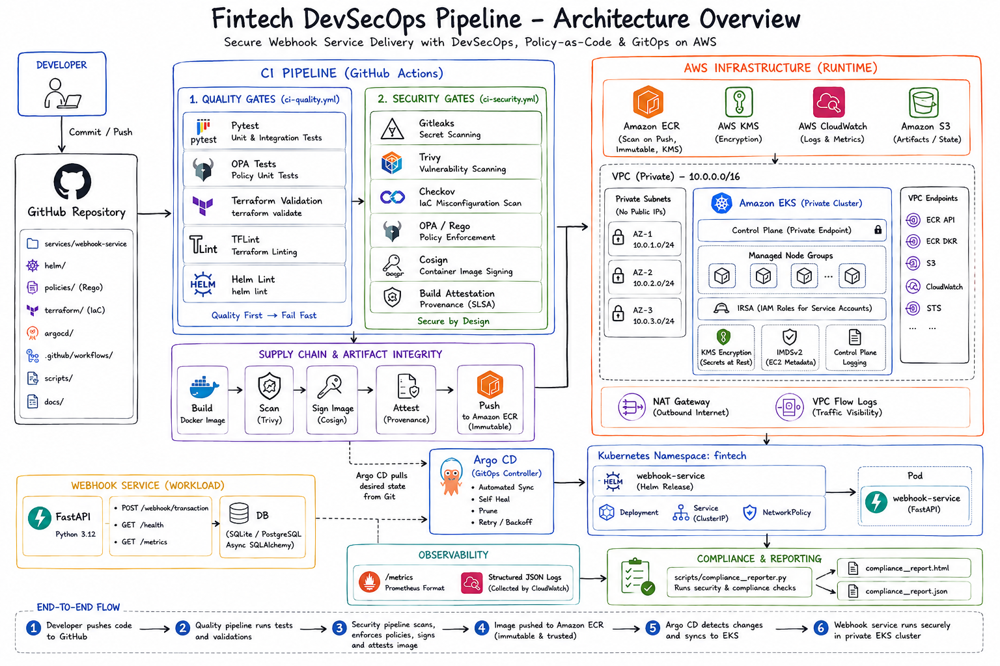

# 🛡️ Fintech DevSecOps Pipeline

**A production-grade DevSecOps platform with a real payment webhook microservice, shift-left quality gates, hardened AWS EKS infrastructure, and GitOps delivery.**

Built for high-uptime payment environments like merchant payment gateways, instant payouts, and settlement processing — where security, reliability, and zero-downtime deployments are non-negotiable.


---

## 🏗️ Architecture



---

## 📂 Project Structure

```
fintech-devsecops-pipeline/
│
├── services/webhook-service/      # FastAPI payment webhook service
│   ├── main.py                    # Application + endpoints
│   ├── models.py                  # Pydantic v2 schemas
│   ├── database.py                # Async SQLAlchemy (SQLite/PostgreSQL)
│   ├── config.py                  # 12-factor env-based config
│   ├── Dockerfile                 # Multi-stage, non-root
│   ├── requirements.txt           # Pinned dependencies
│   └── tests/
│       ├── conftest.py            # Fixtures (in-memory DB, test client)
│       └── test_api.py            # 5 API tests (idempotency, validation)
│
├── terraform/
│   ├── modules/
│   │   ├── vpc/                   # Private subnets, NAT, Flow Logs, VPC Endpoints
│   │   ├── eks/                   # Private EKS, KMS, IMDSv2, IRSA
│   │   └── ecr/                   # Immutable tags, scan-on-push, KMS
│   └── environments/
│       └── production/            # Root module composing VPC + EKS + ECR
│
├── policies/                      # OPA/Rego admission policies
│   ├── container_security.rego    # Privileged, non-root, resource limits, latest tag
│   ├── network_security.rego      # hostNetwork, NodePort, LoadBalancer
│   ├── pci_compliance.rego        # Secrets in env, hostPath, probes, RBAC, labels
│   └── tests/                     # OPA unit tests for each policy
│       ├── container_security_test.rego
│       ├── network_security_test.rego
│       └── pci_compliance_test.rego
│
├── helm/webhook-service/          # Kubernetes packaging
│   ├── Chart.yaml
│   ├── values.yaml                # Security-hardened defaults
│   └── templates/
│       ├── deployment.yaml        # Pod spec with security context
│       ├── service.yaml           # ClusterIP (no external exposure)
│       ├── networkpolicy.yaml     # Ingress/egress restrictions
│       └── serviceaccount.yaml    # IRSA-enabled
│
├── argocd/
│   └── webhook-service-app.yaml   # GitOps: auto-sync + self-heal + prune
│
├── .github/workflows/
│   ├── ci-quality.yml             # Quality gates (Pytest, OPA, TF validate, Helm lint)
│   └── ci-security.yml            # Security gates (Gitleaks, Trivy, Checkov, cosign, Attestation)
│
├── scripts/
│   └── compliance_reporter.py     # Automated compliance sweep + HTML/JSON reports
│
└── docs/
    ├── architecture.md            # Detailed architecture documentation
    └── pci-dss-controls.md        # PCI-DSS requirement mapping
```

---

## 🔐 Security Controls

### CI/CD Security Gates

| Gate | Tool | What It Catches |
|------|------|-----------------|
| Secret Scanning | **Gitleaks** | Leaked credentials, API keys, private keys in commits |
| Container Scanning | **Trivy** | CVEs in base images and Python dependencies |
| IaC Scanning | **Checkov** | Terraform misconfigurations (public S3, unencrypted RDS, etc.) |
| Policy Gate | **OPA/Rego** | Non-compliant K8s manifests (privileged pods, missing probes) |
| Container Signing | **cosign** | Tamper-proof image verification via Sigstore |
| Build Provenance | **Build Attestation** | Cryptographic proof that artifacts came from this CI pipeline |

### Quality Gates (Shift-Left)

| Gate | Tool | What It Catches |
|------|------|-----------------|
| API Tests | **Pytest** | Broken webhook logic, validation bypasses, idempotency failures |
| Policy Tests | **OPA test** | Rego policies that don't actually enforce what they claim |
| IaC Validation | **terraform validate + TFLint** | Syntax errors, deprecated patterns in Terraform |
| Chart Linting | **Helm lint** | Invalid templates, missing values, YAML errors |

### Infrastructure Security (PCI-DSS Aligned)

| Control | PCI-DSS Req | Implementation |
|---------|-------------|----------------|
| Private control plane | Req 1 | EKS endpoint_public_access = false |
| Encrypted secrets at rest | Req 3 | KMS-encrypted K8s secrets |
| IMDSv2 enforcement | Req 6 | Prevents SSRF-based credential theft |
| IRSA (pod-level IAM) | Req 7 | No node-wide credentials, least privilege |
| VPC Flow Logs | Req 10 | Full network audit trail → CloudWatch |
| VPC Endpoints | Req 1 | ECR/S3/STS traffic stays in AWS network |
| Encrypted EBS volumes | Req 3 | All node storage encrypted at rest |
| Immutable ECR tags | Req 6 | Prevents tag overwriting (supply chain) |
| NetworkPolicy | Req 1 | Pod-level ingress/egress restrictions |
| Non-root containers | Req 6 | Hardened runtime security context |

---

## 🚀 Quick Start

### Run the Webhook Service Locally

```bash
cd services/webhook-service

# Install dependencies
pip install -r requirements.txt

# Start the service
uvicorn main:app --reload --port 8000

# Test the health endpoint
curl http://localhost:8000/health

# Send a test webhook
curl -X POST http://localhost:8000/webhook/transaction \
  -H "Content-Type: application/json" \
  -d '{
    "transaction_id": "txn_demo_001",
    "merchant_id": "merchant_001",
    "amount": 1500.00,
    "status": "success",
    "payment_method": "upi"
  }'
```

### Run Tests

```bash
cd services/webhook-service
pip install pytest pytest-asyncio pytest-cov
pytest tests/ -v --cov=. --cov-report=term-missing
```

### Run OPA Policy Tests

```bash
# Install OPA: https://www.openpolicyagent.org/docs/latest/#1-download-opa
opa test policies/ -v
```

### Validate Terraform

```bash
cd terraform/modules/vpc
terraform init -backend=false
terraform validate
```

---

## 📊 Compliance Reports

Run the automated compliance sweep:

```bash
python scripts/compliance_reporter.py --output-dir ./reports
```

Generates:
- `reports/compliance_report.html` — Visual compliance dashboard
- `reports/compliance_report.json` — Machine-readable report for integrations

---

## 🛠️ Tech Stack

| Layer | Technology |
|-------|-----------|
| **Application** | Python 3.12, FastAPI, Pydantic v2, SQLAlchemy 2.0, Prometheus Client |
| **Infrastructure** | Terraform 1.9, AWS EKS 1.30, VPC, ECR |
| **Policy** | OPA / Rego (container, network, PCI-DSS compliance) |
| **CI/CD** | GitHub Actions (quality + security gates) |
| **Packaging** | Docker (multi-stage), Helm 3 |
| **Delivery** | ArgoCD (GitOps, auto-sync, self-heal) |
| **Supply Chain** | cosign (Sigstore), Build Attestation |
| **Scanning** | Gitleaks, Trivy, Checkov, TFLint |

---

## 📝 License

MIT License — see [LICENSE](LICENSE) for details.

---

**Built by [Aman Nikhare](https://github.com/amannikhare)** — DevOps & Cloud Engineer, Dehradun
